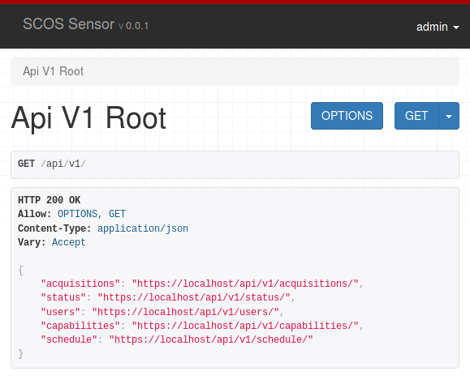

NTIA/ITS SCOS Sensor
====================

The SCOS sensor is a remote API for any sensor that can be controlled via python.

It provides:
  - ready-made containers for x86 and arm32v7 hardware
  - TODO



Quickstart
----------

(See INSTALL for step-by-step instructions)

  - Install `git`, `Docker` and `docker-compose`

```bash
$ git clone https://github.com/NTIA/scos-sensor
$ cd scos-sensor
$ cp env.template env
$ ./scripts/build.sh
$ ./scripts/run.sh
$ ./scripts/createadmin.sh
```

Using Django's `manage.py` Outside of Docker
--------------------------------------------

I recommend using `virtualenvwrapper` when developing and managing the sensor, but it's not strictly necessary. If you plan to use it, you need to install it and set it up before doing the following:

```bash
$ mkvirtualenv scos-sensor  # (`workon scos-sensor` hereafter)
$ set -a
$ source ./env
$ cd src
$ pip install -r requirements-dev.txt
$ python manage.py
```

REST API Reference
------------------

 - [View PDF](docs/api/openapi.pdf)
 - [View HTML](https://rawgit.com/NTIA/scos-sensor/master/docs/api/openapi.html)
